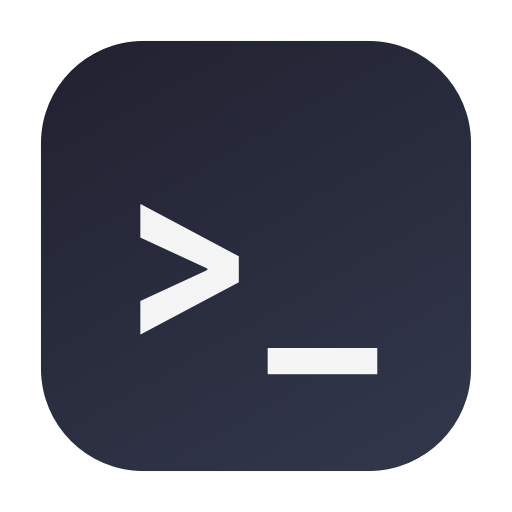

<div align="center">



# DropTerm

**A real terminal, one keystroke away — in your macOS menu bar.**


[](https://github.com/nikita-mogilevskii/dropterm/releases/latest)

</div>

---

Click one key, get your shell. Click away, the session keeps running. Switch back anytime — the prompt's waiting.

```
Ctrl+I     Terminal appears   click away     runs in background     Ctrl+I     back again
```

## Features

- **Persistent session** — tmux-backed when installed (survives even app restarts), plain login shell otherwise
- **Ctrl+I global toggle** — hide/show from anywhere, even fullscreen apps
- **Exit = reset** — `exit` or Ctrl+D respawns a fresh shell with a subtle crossfade
- **Spotlight-style fixed position** — appears near the top center, width-only resizable
- **No Dock icon** — pure menu bar, zero visual clutter
- **Settings panel**
  - Font: choose from system fonts or load custom `.ttf`/`.otf` files
  - Custom shell command — run zsh, bash, nix shell, or other interpreters
  - Background color, opacity, and tiled image support
  - Ctrl+± to scale the font on the fly
- **Ctrl+W to quit** — close the app without losing session state
- **Fast keybinds**
  - Ctrl+D → respawn shell (inside terminal)
  - Ctrl+W → quit app
  - Ctrl+= → increase font size
  - Ctrl+- → decrease font size
  - Ctrl+I → toggle visibility

## Install

### Download (easiest)

1. Grab `DropTerm.app.zip` from the [latest release](https://github.com/nikita-mogilevskii/dropterm/releases/latest)
2. Unzip and drag `DropTerm.app` into `/Applications`
3. **First launch:** the app is ad-hoc signed (no Apple notarization), so macOS will warn you. Right-click `DropTerm.app` → **Open** → **Open**. Or from a terminal:

   ```bash
   xattr -dr com.apple.quarantine /Applications/DropTerm.app
   ```

Requires **macOS 26 (Tahoe)** or newer.

### Build from source

No Xcode needed — Command Line Tools with the macOS 26 SDK are enough:

```bash
git clone https://github.com/nikita-mogilevskii/dropterm.git
cd dropterm
./build.sh          # -> build/DropTerm.app
open build/DropTerm.app
```

## Test

```bash
swift run DropTermTests
```

> **Why not `swift test`?** On machines with only Command Line Tools (no Xcode) there is no `xctest` host binary, so `swift test` silently runs zero tests. The suite is therefore an executable swift-testing host — `swift run DropTermTests`.

## Keyboard Reference

| Action | Key |
|---|---|
| Toggle visibility | **Ctrl+I** |
| Quit app | **Ctrl+W** |
| Increase font | **Ctrl+= / Ctrl++** |
| Decrease font | **Ctrl+-** |
| Respawn shell | **Ctrl+D** (inside terminal) |

## Settings

All settings live in a simple preferences panel accessible via the menu bar. Changes apply instantly:

- **Fonts:** pick from system fonts or drag in custom `.ttf` or `.otf` files
- **Shell:** set any shell command (default: login shell)
- **Background:** choose color (with opacity), or upload an image to tile
- **Exit behaviour:** always respawns fresh

State persists in `UserDefaults` (`~/Library/Preferences`).

## Architecture

`DropTermKit` (session state machine with injectable surface factory, pure tmux/resize resolvers, persisted size store) + thin NSStatusItem-driven borderless key panel (`StatusController`) hosting SwiftUI views over SwiftTerm's terminal emulator. Design docs in `docs/superpowers/`.

## License

[MIT](LICENSE) © 2026 Nikita Mogilevskii
